# CheckIn Tracker

#### Problem
During the COVID-19 pandemic businesses were required to keep track of the how many people were in the businesses space, contact details of customers and other specific compliance issues. 

The Australian government and industry bodies required businsses to have a *'contract tracing register'*, which may be requested by public health officials if needed. It contained the following information:
- date;
- sign in time;
- sign out time;
- name;
- email address;
- residential address;
- contact number; and 
- comments. 
(Link to example contract tracing register: https://www.covid19.qld.gov.au/__data/assets/pdf_file/0034/129967/industry-covid-safe-plan-retail-food-services.pdf)

The register was placed on a table at the front of the restaurant with no methods to protect previous customers information from being copied or misused by other members of the public. 

#### Why does the problem need solving?
CheckIn Tracker ensures that customer information is secured, not susceptible to misuse by other customers and an online solution reducing the need for paper.

CheckIn Tracker provides an online solution and if needed, makes it easy to send the data to the public health officials. This means that restaurants can be compliant with Government requirements. 

#### CheckIn Tracker Link
Link to Heroku:

#### GitHub Repository
Link to GitHub: https://github.com/katrinamarquez/t2a2_checkintracker 

#### Description of CheckIn Tracker
*Purpose*
The CheckIn Tracker is an app where users can securely log into a restaurant they have visited with only the necessary fields. This includes the restaurant, date, time and any comments specific to that restaurant. The aim is to streamline clocking into a restaurant. 

Customers are not required to repeat inputting their (i) name, (ii) email, (iii) address and (iv) phone, for every restaurant the customer visits.

Restaurants are able to display themselves to the user for marketing purposes.

*Functionality/Features*
The functionality of CheckIn Tracker depends upon the type of user. The expected functionalty/features for each user is detailed below. 

A CheckIn is a form allowing the user to select a restaurant, date, time and comments for each restaurant they vist.

Feedback is a form allowing the user to provide feedback to the restaurant. The customer is able to select a restaurant, provide feedback and picture attachment (optional).  

**Restaurant**
- Sign up to the app as a Restaurant
- List the restaurants owned by account owner on the app
- View list of restaurants listed on the app 
- View list of customers CheckIn's on the app
- View customer's feedback on the app
- Edit the restaurant's profile details (i.e. address, name, phone, etc.)

**Customer**
- Sign up to the app as a Customer
- View list of restaurants listed on the app
- Create a CheckIn at a restaurant 
- View a list of their CheckIn's at restaurants 
- Create feedback for a restaurant
- View a list of feedbacks they have provided on the app
- Edit their profile details (i.e. address, name, phone, etc.)

*Sitemap*
See file path t2a2_checkintracker/docs/site_map.pdf

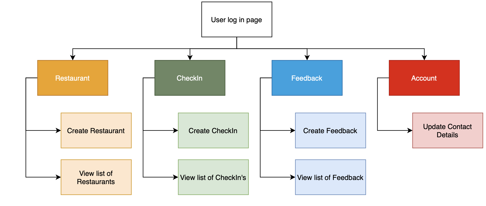

*Screenshots*
1. Log in page
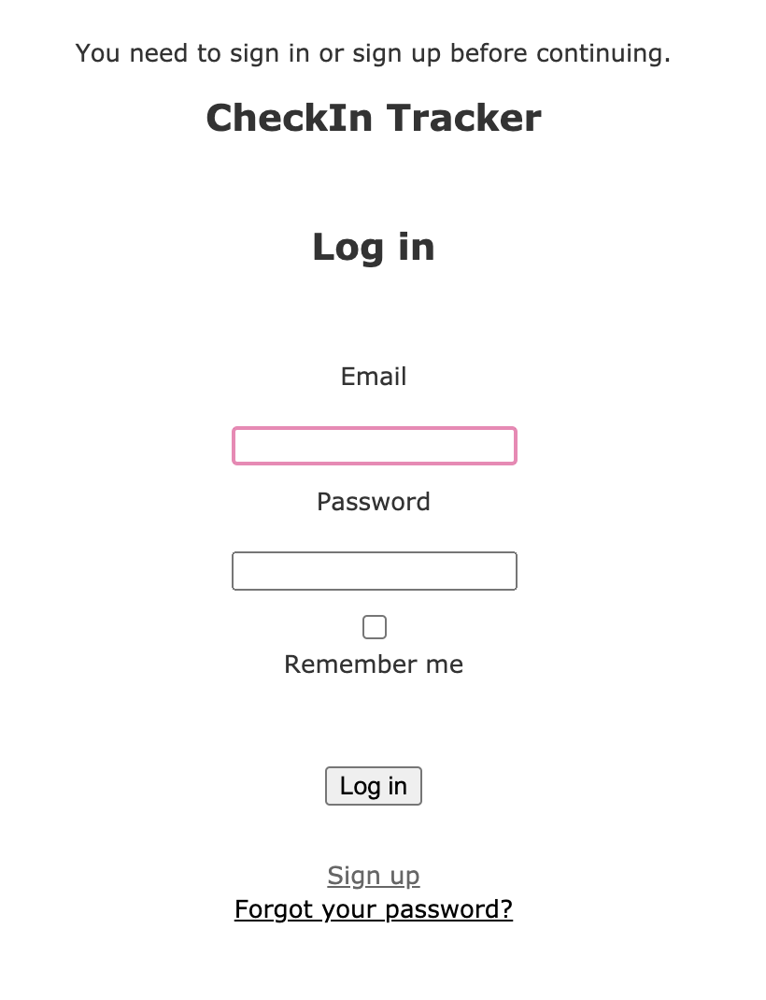

2. Sign up
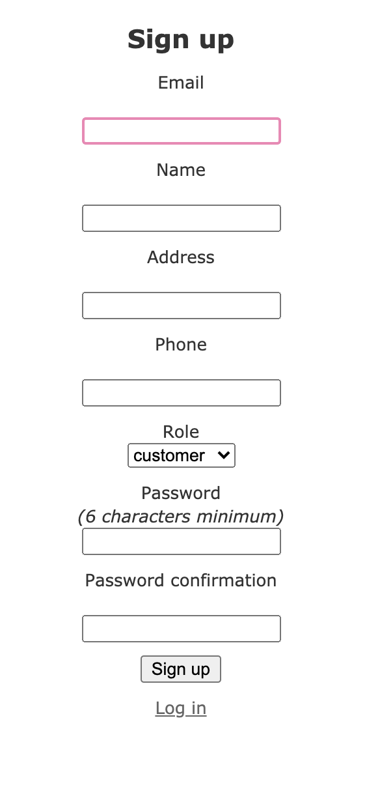

3. Home page after signing in (restaurant users)
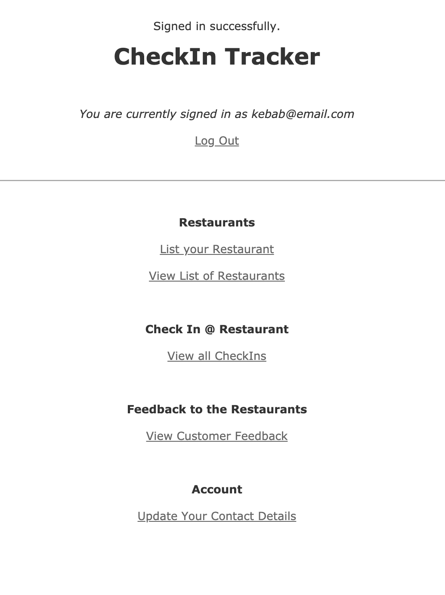

4. Home page after signing in (customer users)
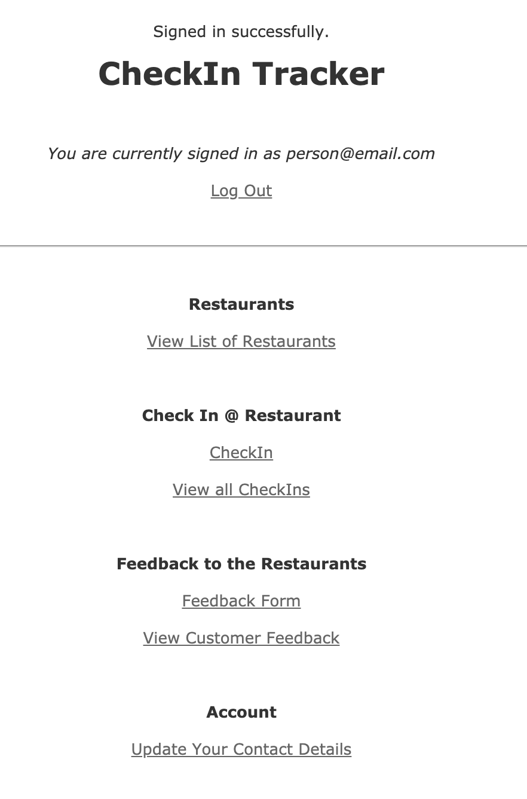

5. List restaurant (restaurant users)
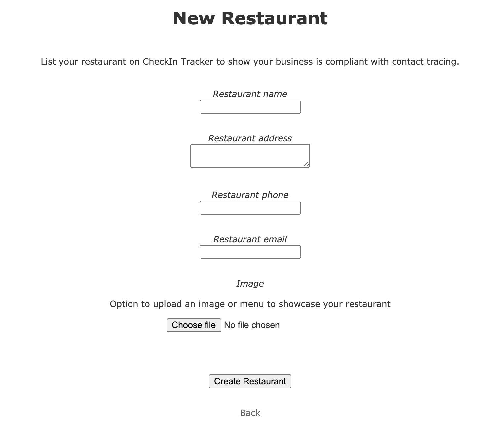

6. View list of restaurants
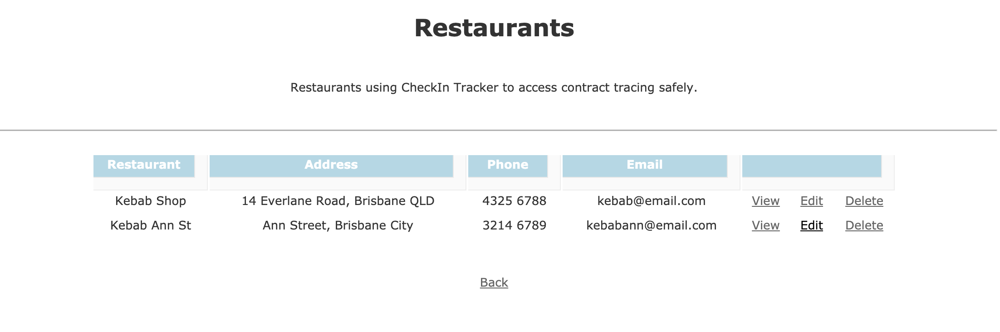

7. Create CheckIn (customer users)
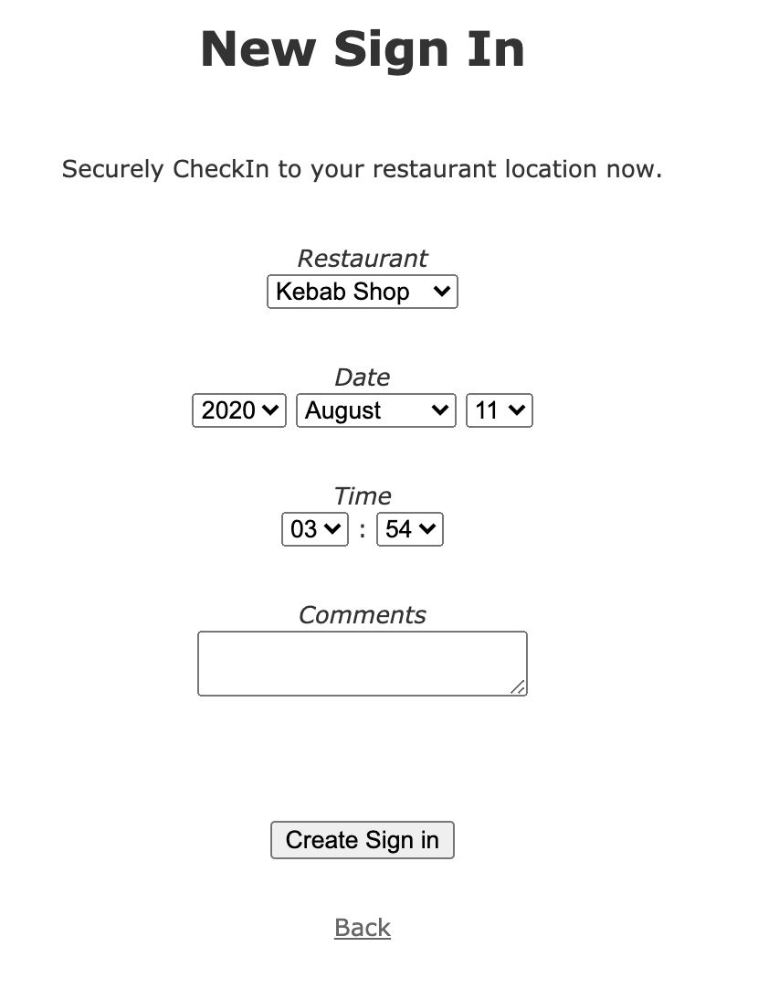

8. View list of restaurants

9. Create Feedback (customer users)
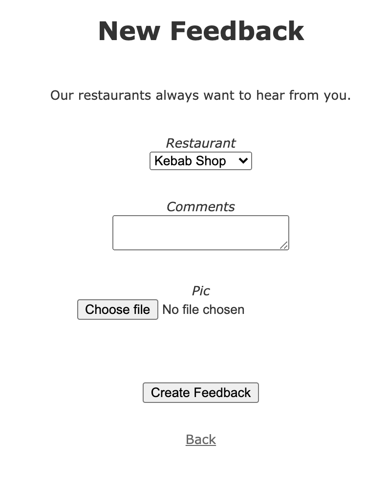

10. View list of feedback
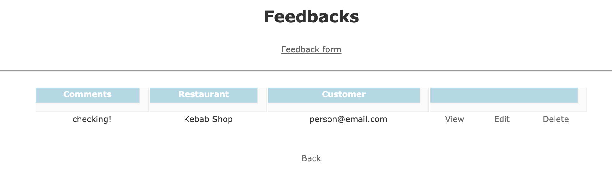

11. Edit account details
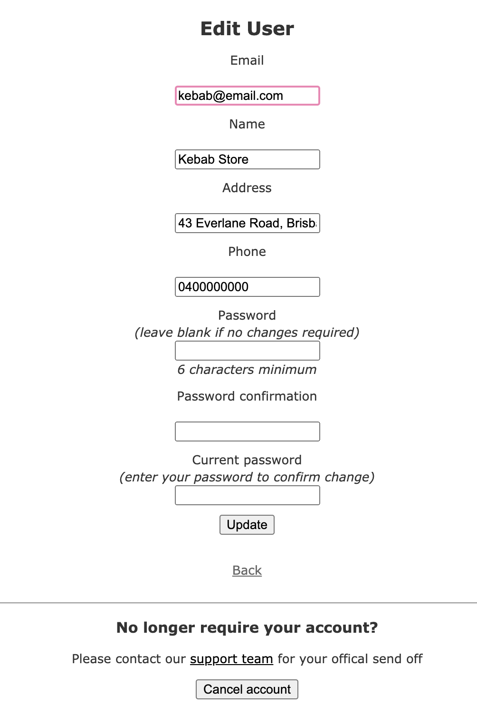

*Target Audience*
There are two target audiences for the CheckIn Tracker. 
- Customers who are eating out during and are required to register their details at a restaurant. Tracking is required for COIVD safety. 
- Restaurants that need to remain compliant with current legal requirements to operate. The correct customer data needs to be obtained and should not be able to be accessed by other users.  

*Tech Stack*
The tech stack for CheckIn Tracker is listed below.
- Ruby 
- Ruby on Rails
- HTML
- CSS 

#### User Stories

There are two types of users on CheckIn Tracker.

**Restaurant**
1. Person signs up under 'Restaurant' user profile.
2. Restaurant is able to add the following details to profile on CheckIn Tracker. 
- Name
- Address
- Phone
- Email
3. Restaurant is listed to customers as a 'sign in' option.
4. Restaurant can see a list of customers that have checked in at their restaurant.  
5. Restaurant has option to check any feedback that has been submitted about the restaurant. 

**Customer**
1. Person signs up under 'Customer' user profile. 
2. Customer is able to add in their contact details.
- Name
- Address
- Phone
- Email 
3. Customer is able to view restaurants avaliable. 
4. Customer is able to sign in at the restaurant. Details include: 
- date in;
- time in; 
- comments; and 
- restaurant. 
5. After visit the customer is able to leave feedback to the restaurant. Attachments included. 

**Admin** 
In future iterations of the app, Admin will be a hidden field on the sign up form and is intended for internal support use at CheckIn Tracker. It is a view only version of the app. 

No intended functionality at the moment for user stories. 

#### Wireframes

#### ERD

#### High-Level Components 
The CheckIn Tracker provides a safe method of remaining compliant with regulations surrounding restaurant operations in COVID. In some restaurants during the pandemic, an A4 piece of paper is at the front of the restaurnt and can be viewed by customers and people walking by the restaurant. This raises concerns around data safety. Further it provides extends use of the app to customer relationship management through its features. 

Restaurants are able to list multiple restaurants under their account, which is then displayed to customers. Listing as a restaurant means that customers are able to CheckIn to the restaurant in an app that aims to provide data security. This means that other customers cannot see data they should not be able to see the users information. 

The ability to provide feeedback is extra features of the app. This aims to create a two way relationship where users can privately provide feedback without fear that other "customers" can see their comment. This creates a marketplace like app where customers can 'talk to restaurants' and 'restaurants can show their COVID compliance to customers'. 

Customers are reassured that their details are being safely obtained. The app aims to show the user a record of where they have been in line with the contract tracing requirements. Further provide methods to give their feedback to restaurants. 

Customers want to be reassured that the restaurant is taking measures to store their data safely and provide a feedback loop. 

#### Third Party Services

CheckIn uses the following third party Rails Gems to provide the service. 

1. Devise: Devise is a user authentication system that manages creation of user profiles, users signing in and out and updating user profiles. This gem ensures that the first page users see is the sign in page on the app. 
2. CanCan:CanCan provides an authorisation library which ensures that the user signed in can only access what they are permitted to access. CheckIn has a Restaurant, Customer and Admin profile. 

#### Project Models

**User**
Information stored under User model:
- email (created by devise)
- encrypted_password (created by devise)
- reset_password_token (created by devise)
- reset_password_set_at (created by devise)
- remember_created_at (created by devise)
- created_at (created by devise)
- updated_at (created by devise)
- name
- address
- phone 
- role

ActiveRecordAssociations of User model:
- user has_many sign_in
- user has_many feedback
- user has_many restaurant

**Restaurant**
- restaurant_name
- restaurant_address
- restaurant_phone
- restaurant_email
- user_id

ActiveRecordAssociations of Restaurant model:
- belongs_to user
- has_one pic
- has_many sign_in

**SignIn (user view on app is called CheckIn)** 
Note: This is called 'Signin' in the database. Renamed to stop user confusion between User sign in and a customer using the form to sign in at a restaurant.

- date_in
- time_in 
- in_comment (Customer can add comments to the CheckIn)
- user_id
- restaurant_id

ActiveRecordAssociations of SignIn model:
- belongs_to user
- belongs_to restaurant 

**Feedback**
- comments
- user_id
- restaurant_id

ActiveRecordAssociations of Feedback model:
- belongs_to user
- has_one_attached pic

#### Database Relations of CheckIn Tracker
A user if set up under the role of a 'restaurant' is able to create many restaurants (*has_many*). This is to cover scenarios where one user login has multiple relationships. 

A restaurant can only belong to one user (*belongs_to*). This is to ensure that a user who did not create the resturant cannot edit or delete a restaurant created by another user. All restaurants can view other restaurants listed on the app, in order to be able to view what customers can view on the index. 

A restaurant can upload an image attached to the listing. 

A user can have many sign in's as a user can check into many restaurants on the app (*has_many*). This enables the user to view a list of all their CheckIn's (i.e. where they have been) on the app. The restaurant the user CheckedIn can be viewed on the index page.   

A user can provide many feedbacks to the restaurant (*has_many*). Each feedback is linked to the user ID and restaurant ID ensuring that the correct customer and restaurant user can view the app.   

A user can upload an image attached to the feedback. This includes scenarios where they want to include a picture of the food, reciept, etc. 

#### Schema Design

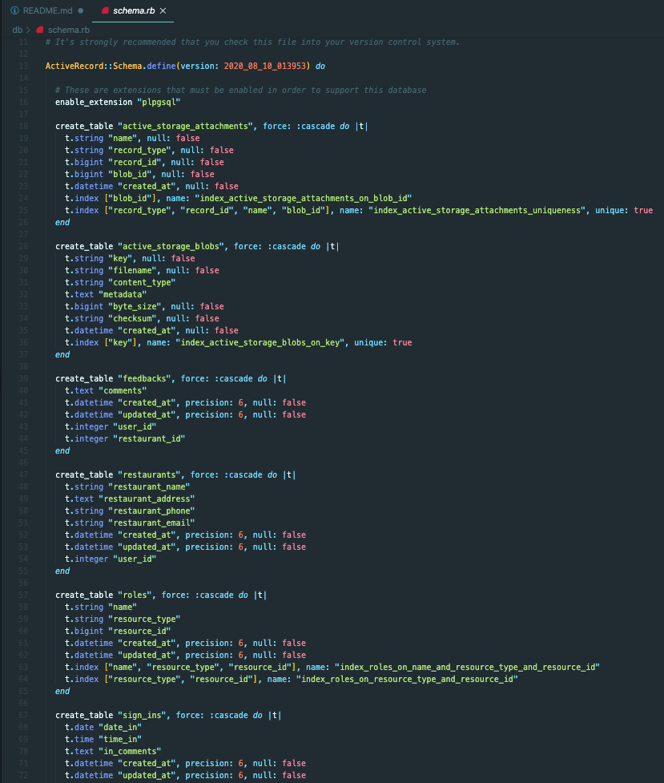

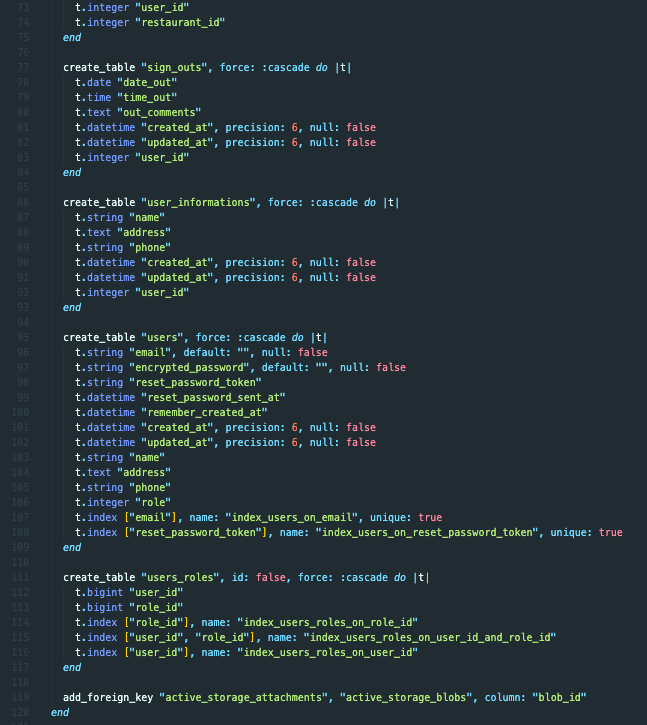

#### Project Management

Tasks and bugs for CheckIn Tracker were managed using Trello. 

Link to Trello: https://trello.com/b/cwkOCyWQ/checkin-tracker-katrina-marquez 

Below is an example of how work and bugs were tracked on Trello. The example below is from 3 August 2020. 
