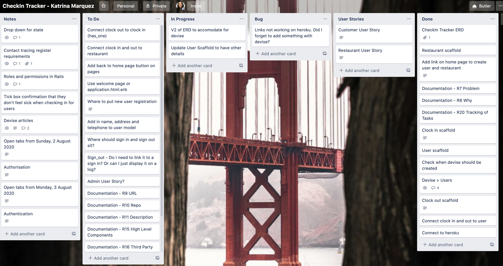

# CheckIn Tracker

#### Problem
During the COVID-19 pandemic businesses were required to keep track of the how many people were in the businesses space, contact details of customers and other specific compliance issues. 

The Australian government and industry bodies required businsses to have a *'contract tracing register'*, which may be requested by public health officials if needed. It contained the following information:
- date;
- sign in time;
- sign out time;
- name;
- email address;
- residential address;
- contact number; and 
- comments. 
(Link to example contract tracing register: https://www.covid19.qld.gov.au/__data/assets/pdf_file/0034/129967/industry-covid-safe-plan-retail-food-services.pdf)

The register was placed on a table at the front of the restaurant with no methods to protect previous customers information from being copied or misused by other members of the public. 

#### Why does the problem need solving?
CheckIn Tracker ensures that customer information is secured, not susceptible to misuse by other customers and an online solution reducing the need for paper.

CheckIn Tracker provides an online solution and if needed, makes it easy to send the data to the public health officials. This means that restaurants can be compliant with Government requirements. 

#### CheckIn Tracker Link
Link to Heroku: https://checkin-tracker.herokuapp.com/

#### GitHub Repository
Link to GitHub: https://github.com/katrinamarquez/t2a2_checkintracker 

#### Description of CheckIn Tracker
*Purpose*

*Functionality/Features*

*Sitemap*

*Screenshots*

*Target Audience*

*Tech Stack*
The tech stack for CheckIn Tracker is listed below.
- Ruby 
- Ruby on Rails
- HTML
- CSS 

#### User Stories

There are two types of users on CheckIn Tracker.

**Restaurant**
1. Person signs up under 'Restaurant' user profile.
2. Restaurant is able to add the following details to profile on CheckIn Tracker. 
- Name
- Address
- Phone
- Email
3. Restaurant is listed to customers as a 'sign in' option.
4. Restaurant can see a list of customers that have checked in at their restaurant.  

**Customer**
1. Person signs up under 'Customer' user profile. 
2. Customer is able to add in their contact details.
- Name
- Address
- Phone
- Email 
3. Customer is able to view restaurants avaliable. 
4. Customer is able to sign in at the restaurant. Details include: 
- date in;
- time in; 
- comments; and 
- restaurant. 
5. After visit the customer is able to leave feedback to the restaurant. Attachments included. 

#### Wireframes

#### High-Level Components 

#### Project Models

#### Database Relations of CheckIn Tracker

#### Schema Design

#### Project Management

Tasks and bugs for CheckIn Tracker were managed using Trello. 

Link to Trello: https://trello.com/b/cwkOCyWQ/checkin-tracker-katrina-marquez 

Below is an example of how work and bugs were tracked on Trello. The example below is from 3 August 2020. 
